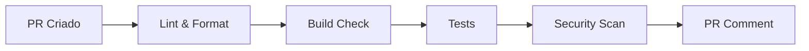
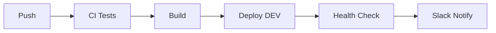
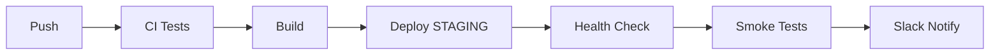
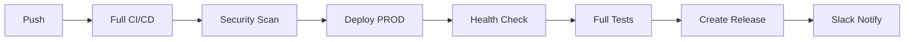
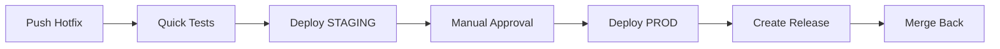

# 🚀 Pipeline CI/CD Automatizada

Esta documentação explica a configuração completa da pipeline automatizada com múltiplos ambientes.

## 📋 Estrutura da Pipeline

### 🔄 **Workflows Principais**

| Workflow | Trigger | Descrição |
|----------|---------|-----------|
| `ci-cd.yml` | Push, PR, Manual | Pipeline principal de CI/CD |
| `pr-validation.yml` | Pull Requests | Validação de PRs |
| `hotfix.yml` | Branch hotfix/*, Manual | Deploy de emergência |
| `test-coverage.yml` | Schedule, Push | Testes completos e cobertura |
| `monitoring.yml` | Schedule, Manual | Monitoramento de produção |

## 🌍 **Ambientes**

### 🔧 Development
- **Branch:** `develop`
- **Deploy:** Automático
- **URL:** `https://dev-backend-clinica.up.railway.app`
- **Uso:** Desenvolvimento ativo

### 🎭 Staging
- **Branch:** `staging`
- **Deploy:** Automático + Smoke Tests
- **URL:** `https://staging-backend-clinica.up.railway.app`
- **Uso:** Validação antes da produção

### 🌟 Production
- **Branch:** `main/master`
- **Deploy:** Automático + Full Tests + Release
- **URL:** `https://backend-clinica.up.railway.app`
- **Uso:** Ambiente live

## 🔑 **Secrets Necessários**

Configure no GitHub Settings > Secrets and variables > Actions:

### Railway Tokens
```
RAILWAY_TOKEN_DEV
RAILWAY_TOKEN_STAGING  
RAILWAY_TOKEN_PROD
RAILWAY_SERVICE_ID_DEV
RAILWAY_SERVICE_ID_STAGING
RAILWAY_SERVICE_ID_PROD
```

### URLs dos Ambientes
```
APP_URL_DEV
APP_URL_STAGING
APP_URL_PROD
```

### Database URLs
```
DATABASE_URL_DEV
DATABASE_URL_STAGING
DATABASE_URL_PROD
```

### Secrets da Aplicação
```
JWT_SECRET_DEV
JWT_SECRET_STAGING
JWT_SECRET_PROD
META_WHATSAPP_TOKEN
META_WHATSAPP_PHONE_ID
WHATSAPP_VERIFY_TOKEN
OPENAI_API_KEY
PINECONE_API_KEY
PINECONE_ENV
PINECONE_INDEX
```

### Integração Slack (Opcional)
```
SLACK_WEBHOOK
```

### Ferramentas de Análise (Opcional)
```
SNYK_TOKEN
SONAR_TOKEN
```

## 🎯 **Fluxo de Trabalho por Branch**

### 📝 Pull Request


### 🔧 Development (develop)


### 🎭 Staging (staging)


### 🌟 Production (main/master)


### 🚨 Hotfix (hotfix/*)


## 🧪 **Tipos de Teste**

### ✅ Testes Rápidos (PR/Push)
- Lint e formatação
- Build check
- Testes unitários básicos
- Security scan básico

### 🔬 Testes Completos (Schedule/Manual)
- Cobertura completa
- Testes de integração
- Performance tests
- Security scan avançado
- Análise de qualidade

### 🚨 Testes de Emergência (Hotfix)
- Testes críticos apenas
- Smoke tests
- Health checks

## 📊 **Monitoramento Automático**

### ⏰ Schedule
- **A cada hora:** Health checks
- **Diário (9h):** Relatório de performance
- **Semanal (Segunda 9h):** Resumo semanal

### 🚨 Alertas
- Falhas de deploy
- Health checks falhando
- Taxa de erro alta
- Performance degradada

## 🎮 **Como Usar**

### 🆕 Feature Normal
1. Crie branch `feature/nome-da-feature`
2. Desenvolva e faça commits
3. Abra PR para `develop`
4. Pipeline valida automaticamente
5. Merge → Deploy automático para DEV

### 🎭 Validação Staging
1. Merge `develop` → `staging`
2. Deploy automático para STAGING
3. Smoke tests executados
4. Validação manual se necessário

### 🚀 Deploy Produção
1. Merge `staging` → `main`
2. Pipeline completa executada
3. Deploy automático para PROD
4. Release criada automaticamente

### 🚨 Hotfix de Emergência
1. Crie branch `hotfix/nome-do-fix`
2. Pipeline rápida executada
3. Deploy obrigatório para STAGING
4. Aprovação manual para PROD
5. Merge automático de volta

### 🔧 Deploy Manual
1. Vá para Actions no GitHub
2. Selecione "CI/CD Pipeline"
3. Clique "Run workflow"
4. Escolha o ambiente
5. Execute

## 📈 **Métricas e Qualidade**

### 📊 Cobertura de Testes
- **Meta:** >80%
- **Relatórios:** Codecov integration
- **Falha:** Build falha se <70%

### 🔒 Segurança
- **npm audit:** Vulnerabilidades high/critical
- **Snyk:** Scan contínuo
- **OWASP ZAP:** Scan semanal

### ⚡ Performance
- **Response Time:** <200ms
- **Throughput:** >500 req/sec
- **Error Rate:** <0.1%

## 🚀 **Próximos Passos**

### 1. Configurar Secrets
Adicione todos os secrets listados acima no GitHub.

### 2. Configurar Railway
Crie 3 projetos no Railway (dev, staging, prod) e obtenha os tokens.

### 3. Configurar Slack (Opcional)
Configure webhook para notificações.

### 4. Testar Pipeline
1. Faça um commit em `develop`
2. Verifique se o deploy para DEV funcionou
3. Teste outros ambientes

### 5. Configurar Monitoramento
Configure UptimeRobot, Sentry ou similar para monitoramento avançado.

## 🆘 **Troubleshooting**

### ❌ Deploy Falha
1. Verifique logs no GitHub Actions
2. Confirme se secrets estão configurados
3. Teste health check manual
4. Verifique Railway dashboard

### 🧪 Testes Falhando
1. Execute testes localmente
2. Verifique se banco de teste está funcionando
3. Confirme variáveis de ambiente

### 🔐 Secrets Inválidos
1. Regenere tokens no Railway
2. Atualize secrets no GitHub
3. Execute workflow manual para testar

### 📞 Suporte
- **GitHub Issues:** Para bugs da pipeline
- **Slack #devops:** Para dúvidas gerais
- **Emergency:** Contato direto do time

---

🎉 **Pipeline Configurada!** Agora você tem deploy automático com qualidade garantida!